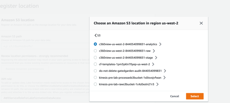
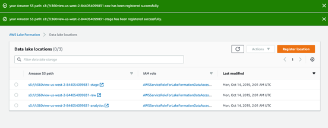
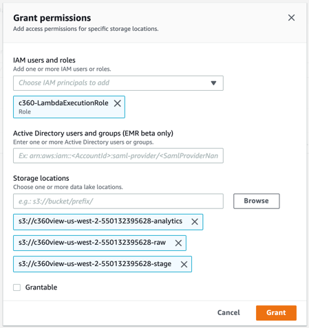

## Setup your Data Lake with Lake Formation


**Step 1:** Go to the [Lake Formation console](Go to the Lake Formation console:):


If this first screen doesn’t open like this go to Permissions -> Admins and database creators, and grant your user as administrator.


**Step 2:** Add your user as Data Lake admin, so your user can administer storage areas, databases and tables.


Add your user as Administrator and Save


**Step 3:** Add the buckets starting with “c360view” as [data lake locations](https://us-west-2.console.aws.amazon.com/lakeformation/home?region=us-west-2#register-list) for Lake Formation. Indicating there are part of your data lake.


**Step 4:** Click Register location.


**Step 5:** Click on Browse and select each c360view bucket to register.



Repeat it for the 3 buckets:
*	c360view-us-west-2-<your_account_id>-raw
*	c360view-us-west-2-<your_account_id>-stage
*	c360view-us-west-2-<your_account_id>-analytics
After registration you will see a screen like the following.




**Step 6:** On Lake formation data locations permission console Click on Grant to grant access to the AWS Lambda, AWS Glue service role and Amazon EMR EC2 role.


*	IAM users and roles: c360-LambdaExecutionRole
*	Storage locations:
  *	c360view-us-west-2-<your_account_id>-raw
  *	c360view-us-west-2-<your_account_id>-stage
  *	c360view-us-west-2-<your_account_id>-analytics




## Verify the data created by the Lambda functions.

Amazon S3 is the central service of Data Lake architecture in AWS. In our solution we are using Lambda functions to pick external data such as BigQuery from GA (Google Analytics)  source: https://www.kaggle.com/bigquery/google-analytics-sample tables and also generate several other synthetic data for other data sets.
The original AWS Lambda code used to extract BigQuery data is the following.

```python
python
from google.cloud import bigquery
import json
import boto3
import os
s3 = boto3.resource('s3')
client = bigquery.Client.from_service_account_json(
    './bqfile.json')
datasets = list(client.list_datasets())
project = client.project
table = os.environ['table']
PATH_TO = os.environ['path_to']
BUCKET_NAME = os.environ['bucket']
QUERY = (
    'SELECT '
    ' TO_JSON_STRING(g) jsonfield '
    ' FROM ` bigquery-public-data:google_analytics_sample..ga_sessions_'+table+'` g '
)
query_job = client.query(QUERY)  # API request

def lambda_handler(event, context):
    tofile=''
    rows = query_job.result()
    for row in rows:
        newfield=row.jsonfield+'\n'
        tofile += newfield
    s3.Object(BUCKET_NAME, PATH_TO+'/ga_sessions_' + table+'/ga_sessions_'+table+'.json').put(Body=tofile)
```

If you want to this code you have to install the the gcloud python sdk libraries directory and generate a bqfile.json with your gcloud service account credentials, then zip the library directory, bqfile.json, and your lambda.py to deploy it to AWS Lambda functions.
Set three environments variables to use it or call table, path_to and bucket.


**Step 1:** Go to [Amazon S3](https://s3.console.aws.amazon.com/s3/home?region=us-west-2) console to check the data in your raw bucket.
Go to Amazon S3 console to check the data in your raw bucket.

Search for c360view buckets.


**Step 2:** Click on the c360view-us-west-2-<YOUR_ACCOUNT_ID>-raw bucket.
Refresh the bucket while the lambda codes are running.


**Step 3:** Enter inside each folder to check the files created inside.


Account data, at account folder.


GA sessions data, at data/GA/ga_session_20YYMMDD folders.


**Step 4:**

**Step 5:**


## Now [Activate schedules](../schedules/README.md)


## License

This library is licensed under the MIT-0 License. See the LICENSE file.
