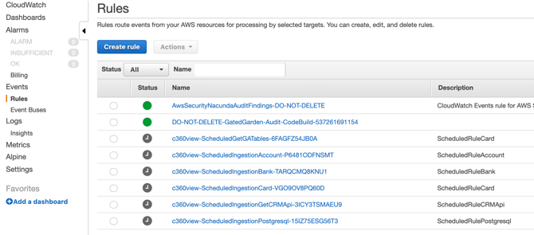
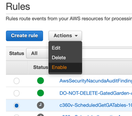

## Activate the schedulers to generate data from different sources


**Step 1:** Go to [CloudWatch Events -> Rules](https://us-west-2.console.aws.amazon.com/cloudwatch/home?region=us-west-2#cw:dashboard=Home), and enable each of the c360v-Schedule.




**Step 2:** Check the item, go to Actions and Enable.




**Step 3:** Repeat step 2, this until all are green.


## Verify the data created by the Lambda functions.

Amazon S3 is the central service of Data Lake architecture in AWS. In our solution we are using Lambda functions to pick external data such as BigQuery from GA (Google Analytics)  source: https://www.kaggle.com/bigquery/google-analytics-sample tables and also generate several other synthetic data for other data sets.
The original AWS Lambda code used to extract BigQuery data is the following.

```python
python
from google.cloud import bigquery
import json
import boto3
import os
s3 = boto3.resource('s3')
client = bigquery.Client.from_service_account_json(
    './bqfile.json')
datasets = list(client.list_datasets())
project = client.project
table = os.environ['table']
PATH_TO = os.environ['path_to']
BUCKET_NAME = os.environ['bucket']
QUERY = (
    'SELECT '
    ' TO_JSON_STRING(g) jsonfield '
    ' FROM ` bigquery-public-data:google_analytics_sample..ga_sessions_'+table+'` g '
)
query_job = client.query(QUERY)  # API request

def lambda_handler(event, context):
    tofile=''
    rows = query_job.result()
    for row in rows:
        newfield=row.jsonfield+'\n'
        tofile += newfield
    s3.Object(BUCKET_NAME, PATH_TO+'/ga_sessions_' + table+'/ga_sessions_'+table+'.json').put(Body=tofile)
```

* **Stack name:** c360view
*	**Network Configuration:**
 *	Which VPC should this be deployed to?: *Default VPC (172.31.0.0/16)*
 *	SubnetAz1: (172.31.0.0/20) (look for this IP range)
 *	SubnetAz2: (172.31.16.0/20) (look for this IP range)
*	**InstanceKeyPairParameter:** c360view-oregon (the one that you created before)


**Step 4:** Choose Next for the next window.


**Step 5:** Check the “I acknowledge that AWS CloudFormation might create IAM resources.”  and Create stack.


**Step 6:** Go to Resources tab to look for completion of resources.


The template has created the following resources to optimize your time.
3 Amazon S3 buckets:
*	RawDataS3Bucket
*	StageDataS3Bucket
*	AnalyticsDataS3Bucket

1 RDS instance with PostgreSQL database to simulate your transaction database.
*	RDSSource – sourcemf

6 Lambda functions to generate data for different source.
*	c360viewCRMApi
*	c360viewGetCRMApi
*	c360viewGetGaTables
*	c360viewMFgenAccount
*	c360viewMFgenCard
*	c360viewMFgenGBank
5 CloudWatch events schedules, to trigger the Lambda functions.

2 Security group, firewalls, one for the EC2 instance, other for Replication instances and Lambda functions.

1 Role for the AWS Lambda functions
1 Role for the AWS Glue

1 Amazon EMR cluster

Check the status of each resource, and order by resource status.


If the resource Type “AWS::RDS::DBInstance” and “AWS::EMR::Cluster” are the only with status CREATE_IN_PROGRESS, and all the others are CREATE_COMPLETE you can continue the execution.


## Now [Activate schedules](../schedules/README.md)


## License

This library is licensed under the MIT-0 License. See the LICENSE file.
